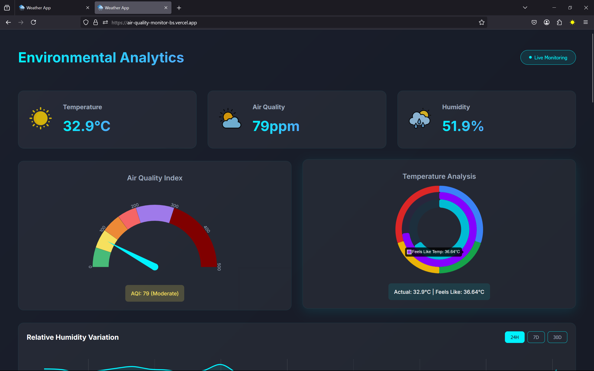
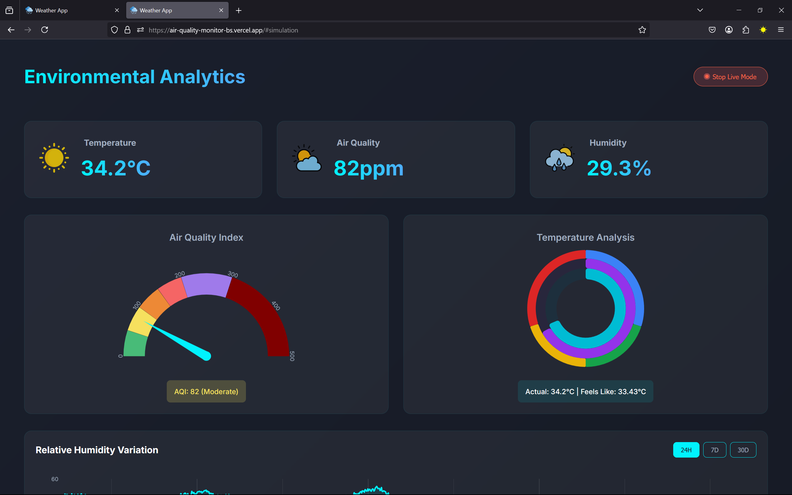
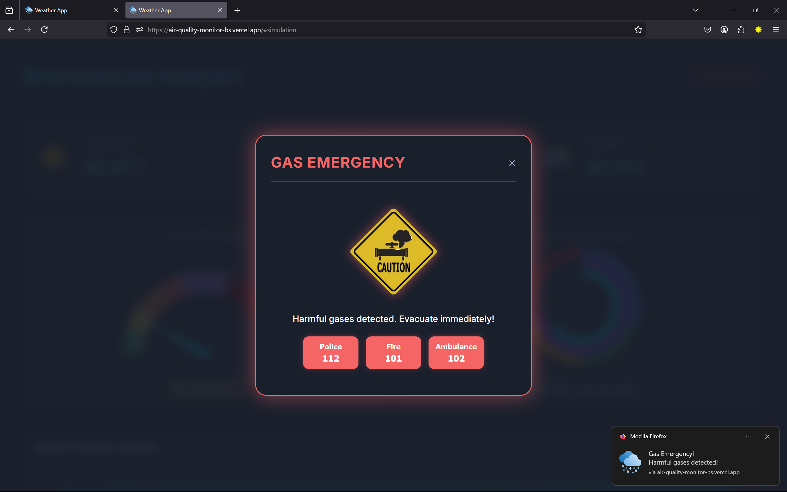
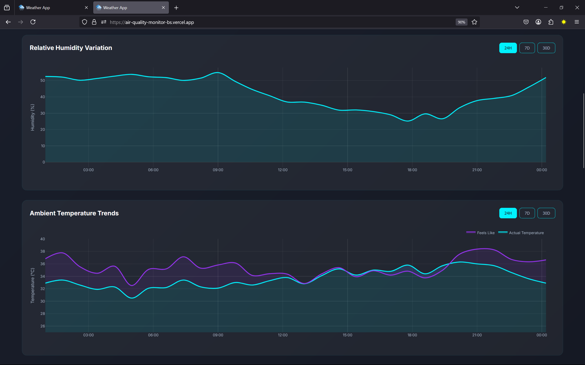
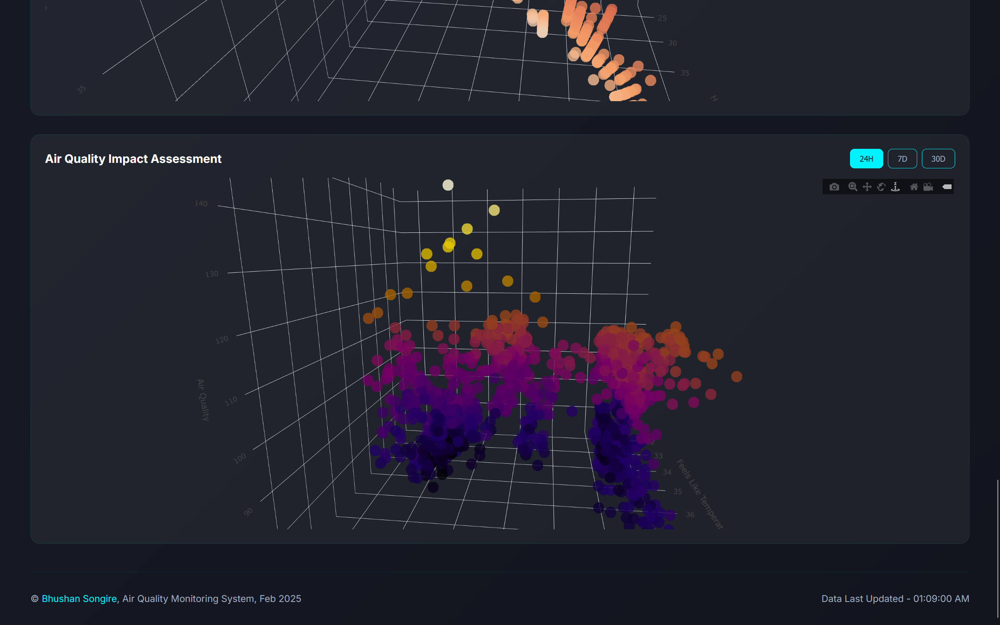
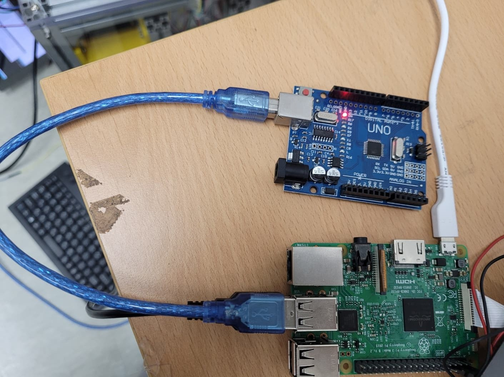
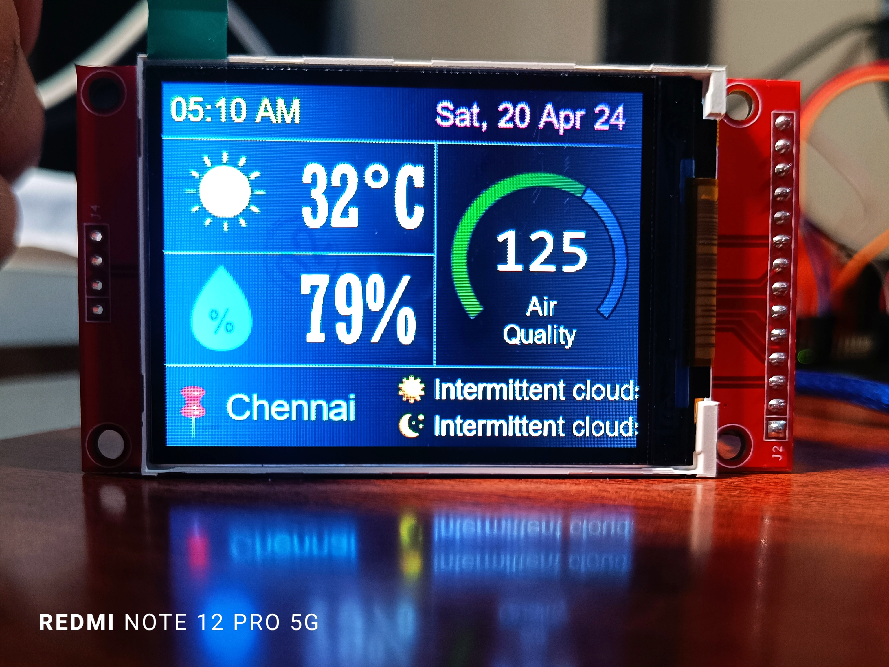
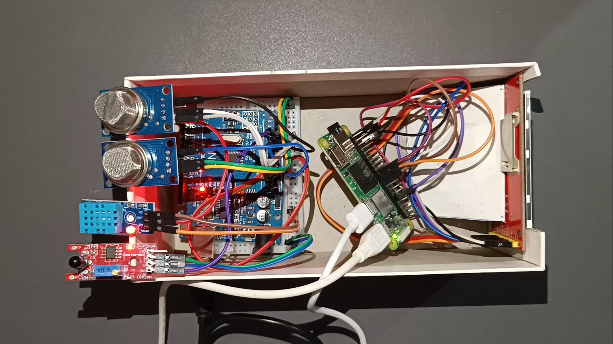
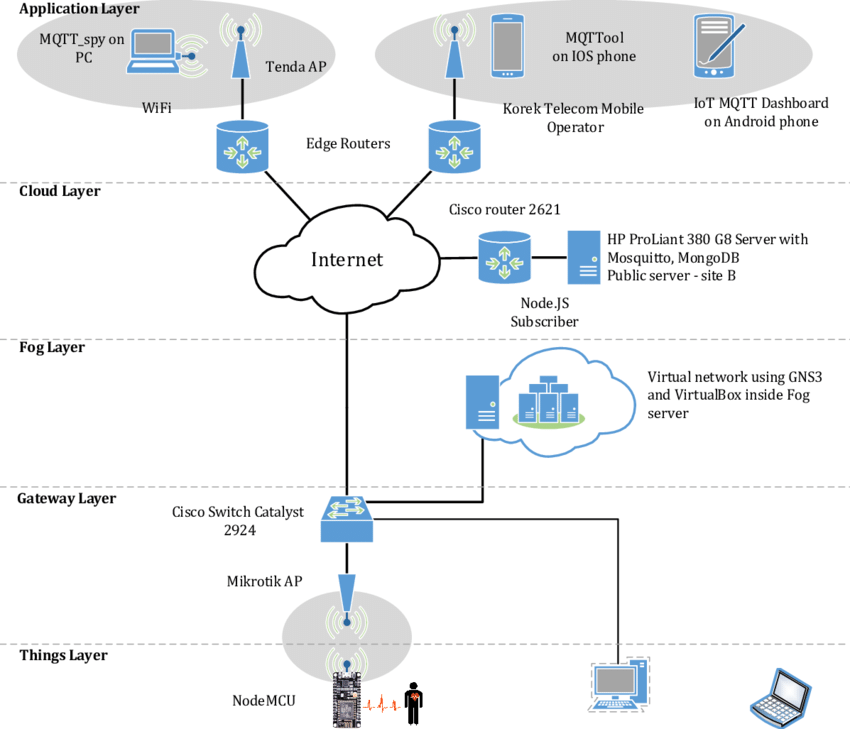
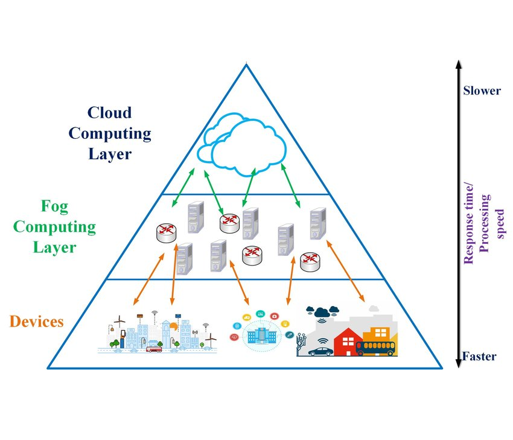

# `Air Quality` (HVAC) Monitoring Web App
This repository contains the updated version of website created to display the content of <u>real-time</u> HVAC <i>(Heat, ventilation, and air conditioning)</i> data monitoring.

## Description
+ This project was developed as part of the `(BCSE313L) Fog and Edge Computing` course at VIT-Chennai.  
+ The website serves as a responsive dashboard, offering visual representations of both historical and real-time data collected from various sensors and hardware components.  
+ As a pre-requisite for the project in the subject, this project adheres to the C2F2T (Cloud-to-Fog-to-Things and its reverse) model, as explained in the subsequent [section](#c2f2t-architecture).

## Table of Contents

- [`Air Quality` (HVAC) Monitoring Web App](#air-quality-hvac-monitoring-web-app)
  - [Description](#description)
  - [Table of Contents](#table-of-contents)
  - [Features](#features)
  - [Tech-Stack](#tech-stack)
  - [Project Overview](#project-overview)
  - [C2F2T Architecture](#c2f2t-architecture)
  - [Links](#links)
  - [License](#license)
  - [Contact](#contact)

## Features

   1. **User-Friendly Web Interface** 🌐  
      Provides a fully functional, responsive and interactive website, featuring regular updates and a comprehensive view of air quality data anywhere.
      

   1. **Real-time Monitoring** ⏳  
      Continuously tracks air quality levels, providing instant data updates for timely analysis and response.
      

   1. **Low Latency Operations** ⚡   
      Ensures minimal delay in data processing and visualization, allowing for accurate real-time insights and decisions.
      
   1. **Emergency Alert System** ⚠️  
      Automatically sends immediate alerts for critical air quality levels, including fire or gas leakage detection, ensuring rapid response to potential hazards.
      

   1. **Comprehensive Data Collection** 📊   
      Utilizes a variety of sensors to gather diverse and comprehensive environmental data. Setup shown in the [hardware setup section](#hardware-image).
      

   1. **Interactive Data Visualization** 📈  
      Presents data in a visually appealing, interactive and easy-to-understand format, enabling users to interpret and analyze information effectively.
      

   1. **Robust Data Storage** ☁️  
      Utilizes Firebase for reliable and scalable NoSQL database storage, ensuring data integrity and accessibility. Enabling robust data management and retrieval.

## Tech-Stack
   - Python
   - HTML
   - CSS
   - JavaScript
   - Firebase

## Project Overview

   * **`Data Collection:`**  
      + Data is collected by using various sensors such as MQ-series sensors, DHT-11, and flame sensors.  
      + An Arduino periodically reads the data from these sensors.

   *  **`Data Passage:`**  
      + Data collected from the sensors by Arduino is passed to the Raspberry-Pi using serial communication at appropriate baud-rate.  
      + 

   * **`Data Filtering and Display:`**  
      + The Raspberry Pi splits, filters, and processes the received data locally.  
      + Weather predictions are fetched using an API for the day and night at the specified location.  
      + Based on the latest locally received data and online predictions, display graphics are generated and updated on an the LCD-TFT display.
      +   
      + 

      + Further, the data is passed to the cloud for storage and further access.

   * **`Data Storage:`**  
      + Firebase, a NoSQL database, is utilized to create, retrieve, and update data.  
      + The data received in this series is stored under specific firebase nodes.

   * **`Web Interface:`**  
      + A fully functional and responsive website is created and deployed on vercel.  
      + The website fetches data from the cloud, and its components are updated periodically.  
      + The website also features an Emergency Alert System, which can be a lifesaver in cases of fire or gas leakage in the monitored area.

   * **`Hardware Setup:`**  
        
      + 

## C2F2T Architecture
   
   1. Cloud-to-Things:  
      - This aspect involves the flow of data and services from the cloud to the edge devices or "things" (such as sensors, actuators, or IoT devices).
      
   1. Things-to-Cloud:  
      - In contrast to C2T, T2C refers to the flow of data and services from the edge devices or "things" to the cloud.  
      
   1. Bidirectional Communication:  
      - The C2F2T model emphasizes bidirectional communication between the cloud and edge devices, enabling seamless interaction and data exchange in both directions.   
      - This approach benefits from various hardware computing power at different nodes in the IoT ecosystem.  
      - Bidirectional communication enables real-time monitoring, control, and decision-making capabilities at the edge while leveraging the extensive computational and storage capabilities of the cloud.

   1. In this project:   
      &nbsp; &nbsp; &nbsp;
      
      &nbsp; &nbsp; &nbsp;
      
    
      1) **Things**:  
         - All sensors act as things. 
         - Things collect the data on ground level.  
      2) **Edge**:  
         - The edge device is an Arduino, which has limited computing power and basic computer functionalities.
         - It collects and temporarily stores the data within its limited small storage capabilities.  
      3) **Fog**:  
         - A Raspberry Pi is the middle device in the project. It gets data from the edge level, filters, and processes it with its relatively large compute power.
         - The RasPi thus acts as the fog layer.  
      4) **Cloud**:  
         - Finally, data is collected in the cloud.  
         - This data is then used to serve the website.  
         - The cloud can also be utilized to run predictive models and gain meaningful insights from the data.
         - Thus, leverages the power of machine learning and the resource-intensive nature of cloud infrastructure.

## Links

1. Visit the deployed project on Vercel:  
   

1. Video demonstration of project implementation:  
   

## License
   
   

## Contact
|||
| - | - |
| **Email** | [bhushanbsongire@gmail.com](mailto:bhushanbsongire@gmail.com) |
| **LinkedIn** | [bhushan-songire](https://www.linkedin.com/in/bhushan-songire/) |

